# Listly — Project Overview

This document is the central reference for project materials related to Listly. Add screenshots, diagrams, and other supporting artifacts in [`docs/images/`](./images/) and link them here with relative paths so they render correctly in Git and in your editor preview.

## Repository Materials

- `docs/overview.md` — project overview and linked assets
- `docs/images/` — screenshots, ER diagrams, and architecture images
- `reports/report_writeup.md` — explanation of the reporting features and report-specific screenshots

## Project Summary

Listly is a marketplace web application where users can browse listings, post items for sale, place offers, message other users, complete transactions, leave reviews, and view marketplace reports. The application uses a React frontend and an Express backend connected to a MySQL database.

## Application Structure

### Frontend

The frontend is organized around React routes defined in `frontend/src/App.jsx`. Main user-facing pages include:

- Home / browse listings
- Listing detail
- Create listing
- My listings
- My offers
- Messages
- Profile
- Reports
- Login / register
- Admin users
- Admin listings

### Backend

The backend is started in `backend/server.js` and exposes routes for:

- Authentication
- Listings
- Offers
- Messages
- Reviews
- Transactions
- Reports
- Admin tools

### Reports

The reports page displays two aggregated reports fetched from the backend:

- Seller Performance Summary
- Category Market Overview

These are implemented in `backend/routes/reports.js` and rendered in `frontend/src/pages/Reports.jsx`.

## UI Screenshots

These screenshots show off the core components and flow of Listly's UI

### Main Pages

#### Home Page
Users have the ability to browse item listings and search by name and/or filter by category

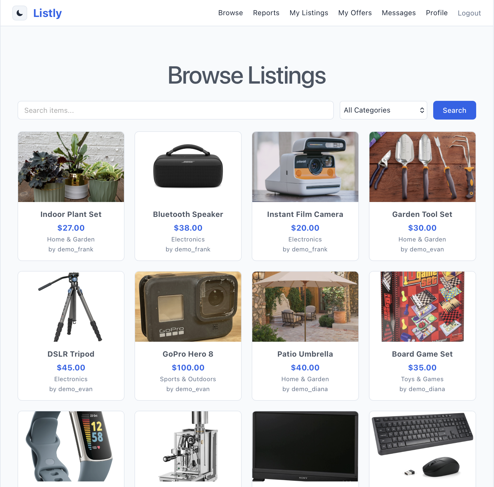

#### Listing Detail Page
Users can view the details of an item listing by selecting it from the Home/Browse page

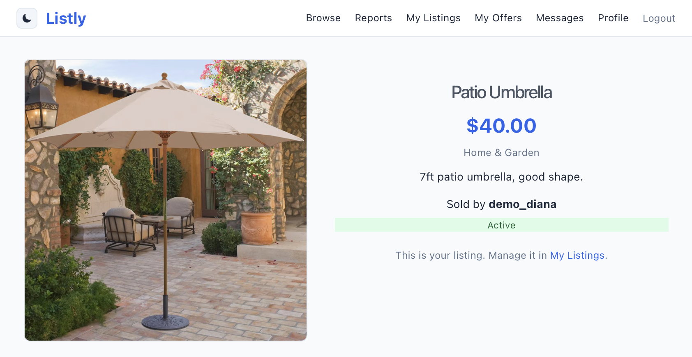

#### Messages Page
Users can initiate a conversation through an item listing by messsaging the seller, then continue from the Messages tab

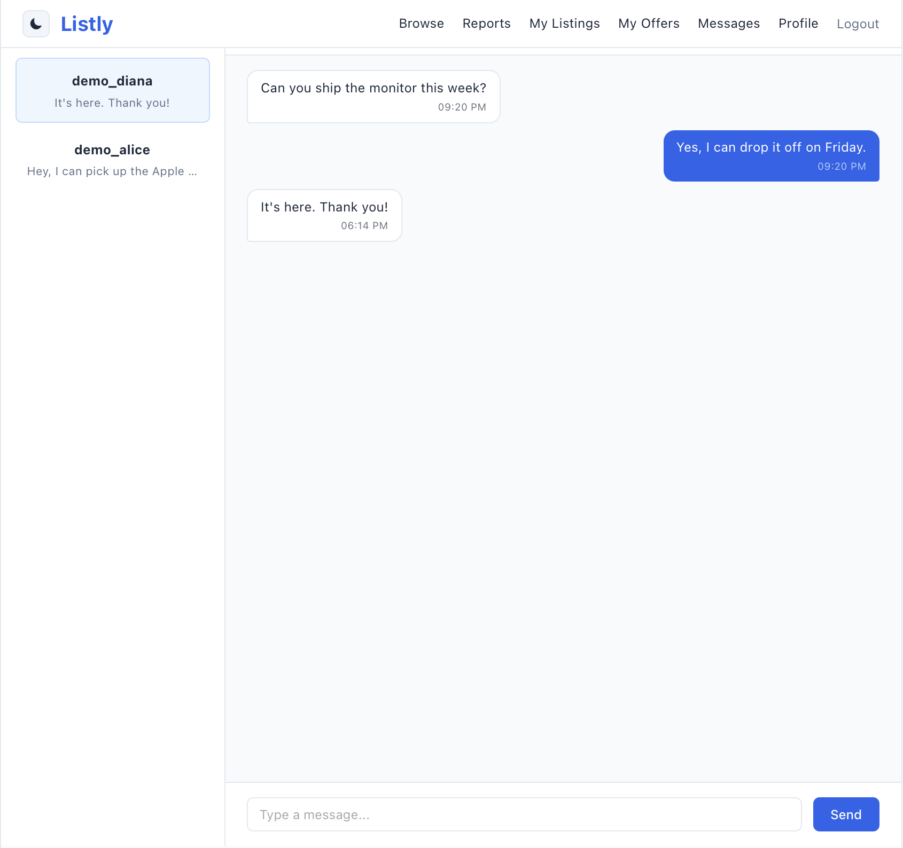

#### My Listings Page
Users can view their posted listings from this page. From here they can edit, delete, and view the status or offers for this listing

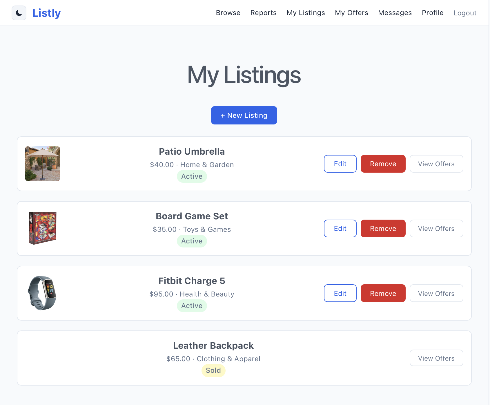

#### Post Listing Page
Users can create and post a new listing by clicking '+ New Listing' on the My Listings page

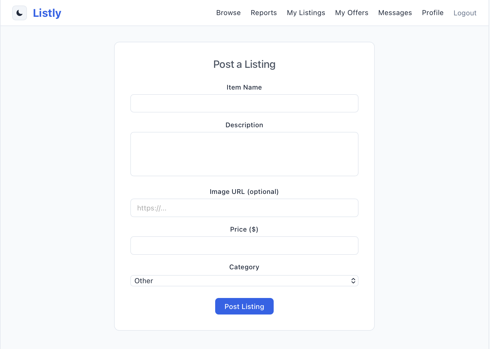

#### Profile Page
Users can view their listings, transaction history, and any reviews they have recieved here. They also have the ability to delete their account

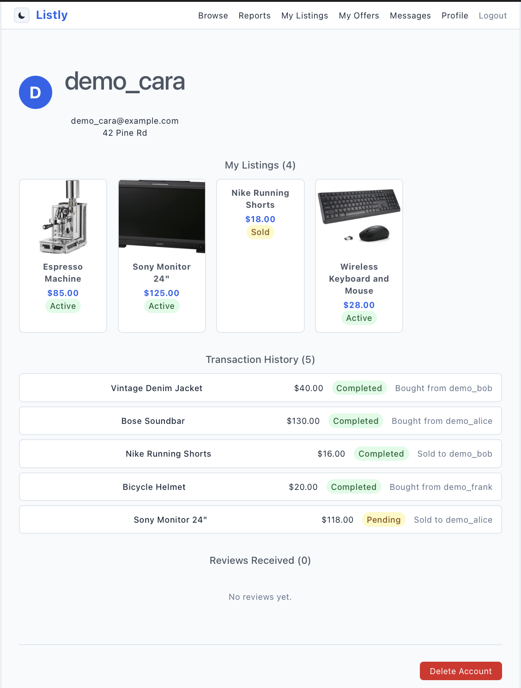

### Reports

#### Reports Page and Seller Performance Summary
Users can view marketplace reports on this page. The Seller Performance Summary ranks sellers by total revenue and other statistics to show the most active users on the site

Further details are available in report_writeup.md

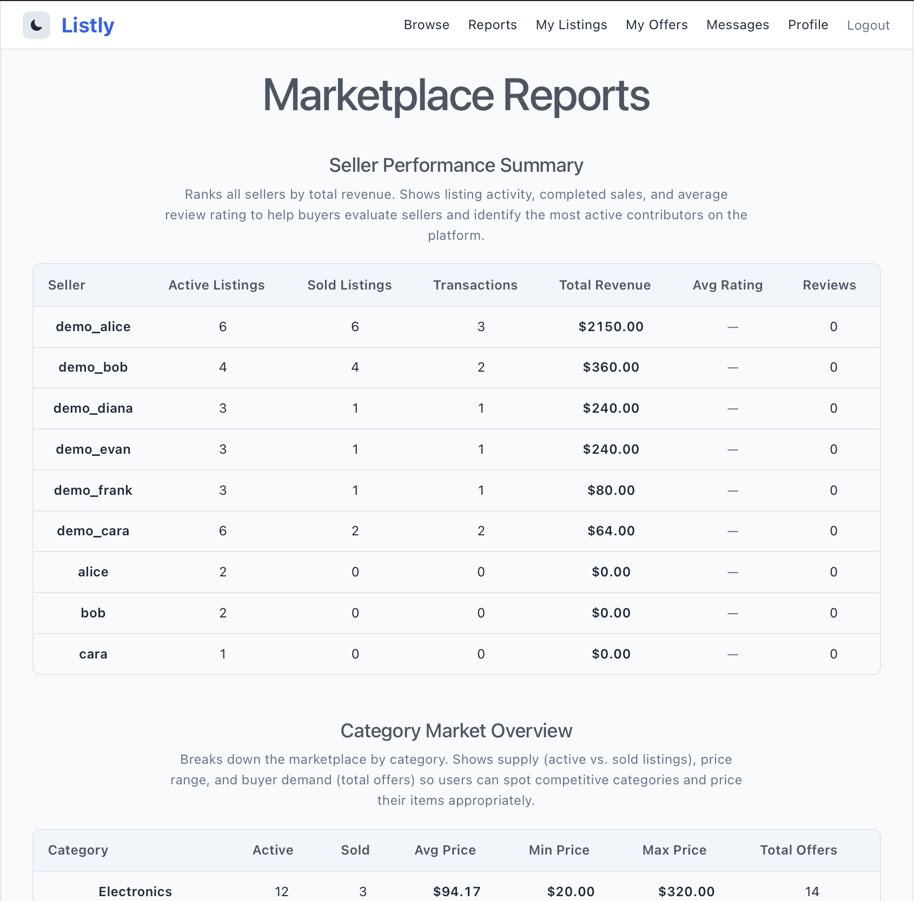

<!-- #### Seller Performance Summary
 -->

#### Category Market Overview
Breaks down the market by category, allowing users to get a view of price ranges and competition levels amoung categories

Further details are available in report_writeup.md

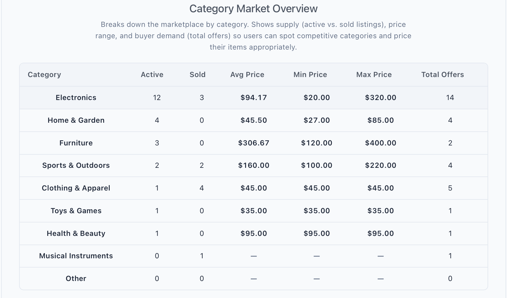

### Admin Views

#### Admin Users Management Page
Admins can view and manage all users on Listly. Admins can create, delete, or promote users to admin from here.

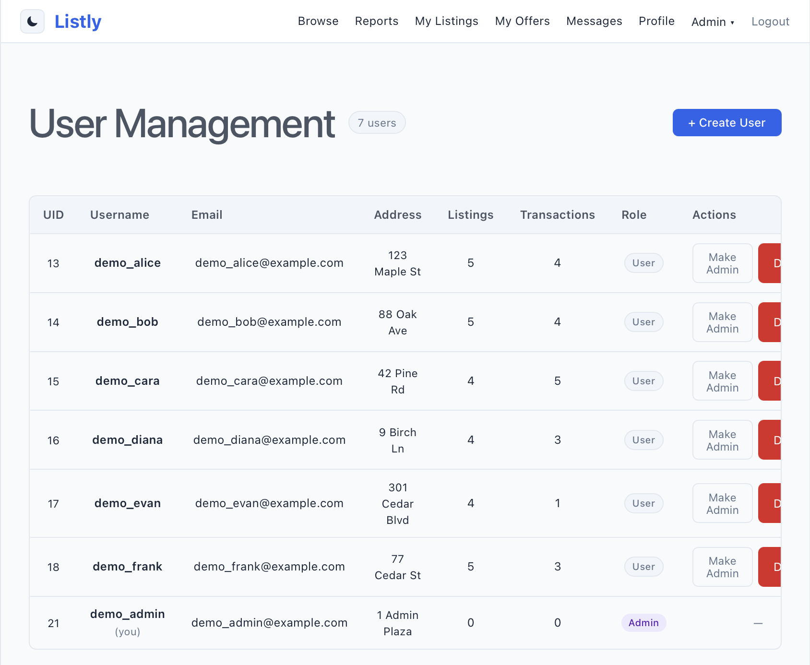

#### Admin Listing Management Page
Admins can view an overview of all listings on Listly, active, sold, or removed, their details, and remove them if necessary

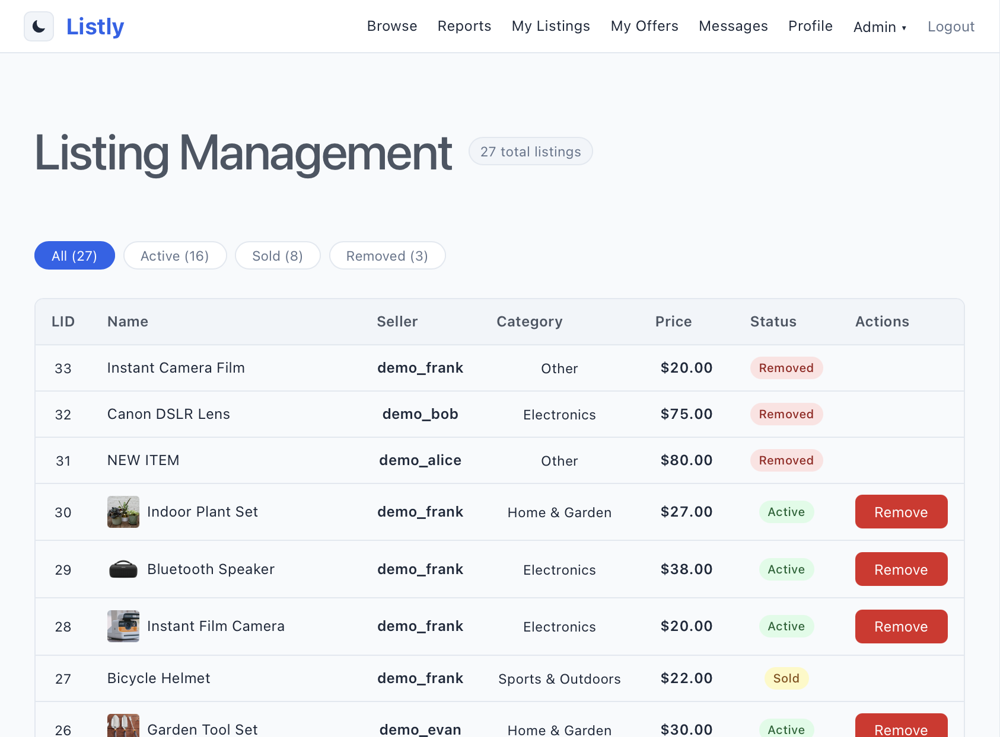

## Diagrams

### ER Diagram

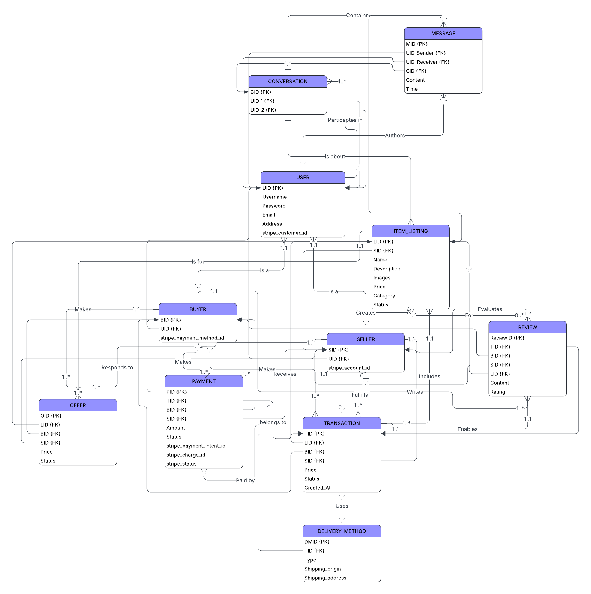

https://lucid.app/lucidchart/d16b1005-cb55-46f0-8bde-e43ccc261b51/edit?invitationId=inv_fa78264d-5175-4036-87f6-3f69b478b0c2&page=0_0#

### System Architecture Diagram

The Listly system architecture consists of four main components: the user-facing React frontend, the Express backend API, JWT-based authentication, and the MySQL database. Users interact with the application through the frontend, which sends HTTP/JSON requests to the backend for features such as authentication, listings, offers, messaging, reviews, transactions, reports, and admin tools. The backend processes requests, applies authentication and admin middleware where needed, and executes SQL queries against the MySQL database to store and retrieve marketplace data. JWT tokens are used to secure protected routes and maintain authenticated user sessions.

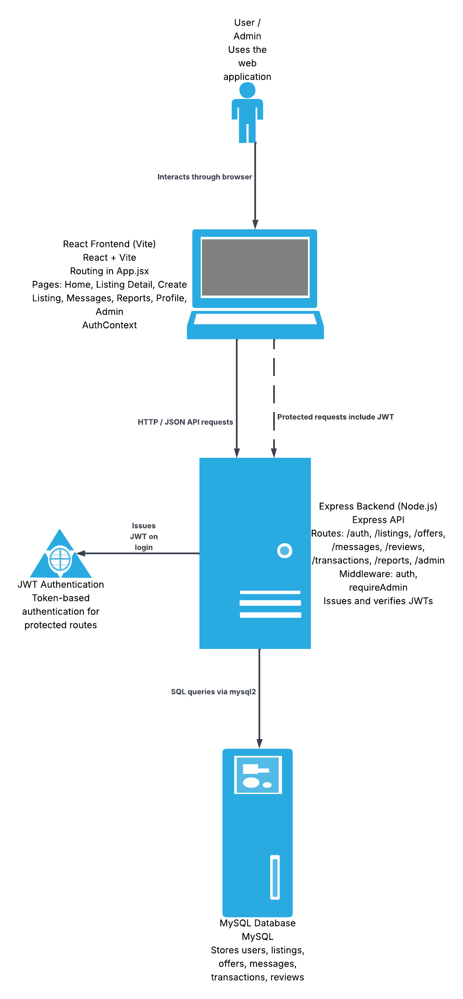